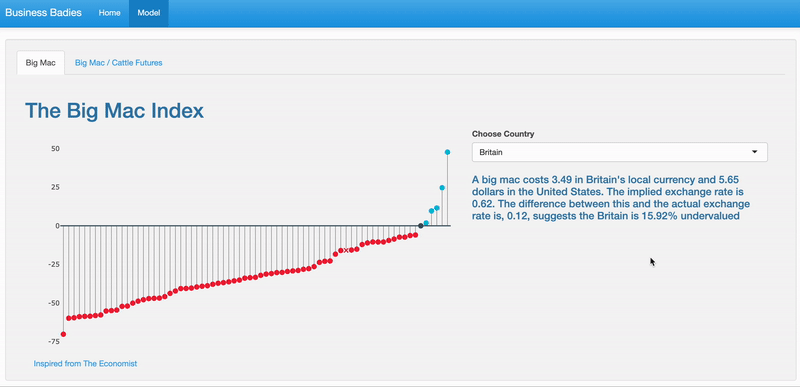

# Extended Big Mac Index

This repository consists of code on how do we add the cattle data into the existing calculation of [Big Mac Index from The Economist](https://www.economist.com/big-mac-index).

This repo can be divided into 2 parts: **data wrangling section**, where we do data cleaning and merge the datasets used into single final dataset, and **data visualization section**, where we generate graphs and dashboards to get a better picture of a state of any given country and get insights from it.

## Data Wrangling section
This section explains on data acquisition and data preprocessing. 

### Data acquisition
The Big Mac Index data is available in the [Big Mac Index repository from the Economist](https://github.com/TheEconomist/big-mac-data).  Based on the source, big mac prices are from McDonald’s directly and from reporting around the world; exchange rates are from Thomson Reuters; GDP and population data used to calculate the euro area averages are from Eurostat and GDP per person data are from the IMF World Economic Outlook reports.

Cattle futures data is retrieved from [Yahoo Finance](https://finance.yahoo.com/quote/LE%3DF/history?period1=1015200000&period2=1633478400&interval=1d&filter=history&frequency=1d&includeAdjustedClose=true&guccounter=1&guce_referrer=aHR0cHM6Ly9sb2dpbi55YWhvby5jb20v&guce_referrer_sig=AQAAAGCpe03QebHzUStS2mougl8dnCKJAI-ZyXcfxtvlxyfxGjS1lqE8u4TUsHkg3F3PI3zDSKJd4HZgW-8v7eGWYC2e3--U52QtxztdCs8137CThk1b94VTOHM6MkGVnUlCoBq0dyV_GoDX16AG87SZhF8yG1fBrCRv3sHdq3SYD9SB) and stored in a google sheet [here](https://docs.google.com/spreadsheets/d/1DrBVZoM5-B5d23bevXhAXY-jh8Z17KsypR1tD66cNVc/edit?usp=sharing) (cleaning steps is in the "Instructions" tab).

all input data are stored in `./data/data_raw`:
* `big-mac-historical-source-data.csv` contains raw values for 1986-1999 period.
* `big-mac-source-data.csv` contains raw values for 2000-2021 period.
* `Live Cattle Futures Data - Sheet1.csv` contains raw values of cattle futures from 2000-2021 period.

### Data preprocessing
To get the processed data for big mac index, go to terminal prompt and run:
```
$ Rscript R/raw_preprocessing_big_mac.R
```

To get the processed data for cattle futures, go to terminal prompt and run:
```
$ Rscript R/raw_preprocessing_cattle.R
```

To generate the final dataset (please ensure that you already run the previous two preprocessing commands above), go to terminal prompt and run:
```
$ Rscript R/data_merge.R
```

## Visualization section


we made [a dashboard](https://businessbaddies.shinyapps.io/big_mac/) using shiny app in R.
  
## Installations
To get started, you’ll need to install R and some necessary packages. we recommend using [Homebrew](https://brew.sh/) to manage package dependencies when installing necessary packages and tools. 

### HomeBrew
To install Homebrew, open terminal and run:
```
$ /usr/bin/ruby -e "$(curl -fsSL https://raw.githubusercontent.com/Homebrew/install/master/install)"
```

### R
At a terminal prompt, run:
```
$ brew install R
```

### R libraries
we employ these packages in this project:
- [tidyverse](https://www.tidyverse.org/): [collection of R packages designed for data science projects.
- [janitor](https://garthtarr.github.io/meatR/janitor.html): for examining and cleaning dirty data.
- [data.table](https://rdatatable.gitlab.io/data.table/): provides a high-performance version of  [base R](https://www.r-project.org/about.html)’s  `data.frame`  with syntax and feature enhancements for ease of use, convenience and programming speed.
- [docstring](https://cran.r-project.org/web/packages/docstring/vignettes/docstring_intro.html): provides the ability to display something analagous to Python’s docstrings within R.
- [shiny](https://shiny.rstudio.com/): for building interactive web apps straight from R.

To install all these packages in a single line, go to terminal prompt and run:
```
> install.packages(c('tidyverse', 'janitor', 'data.table', 'docstring', 'shiny'))
```

You’re all set.

## Contribute
Feedbacks and suggestions are always welcome! please reach us through email below:
* shrey.khetrapal.gr@dartmouth.edu
* margaret.meiners.tu22@tuck.dartmouth.edu 
* yanting.hua.gr@dartmouth.edu
* gibran.erlangga.gr@dartmouth.edu